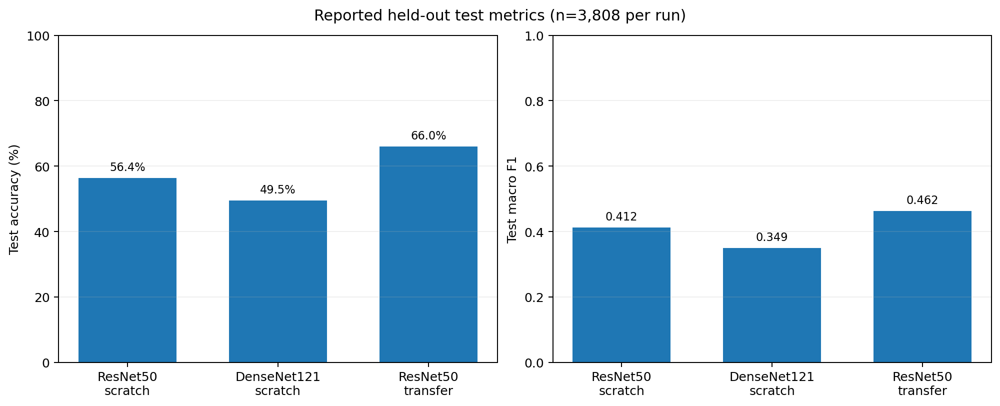
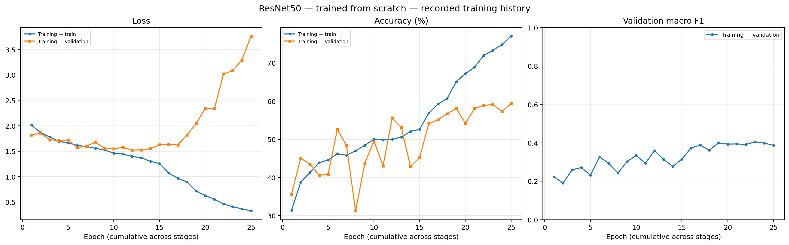
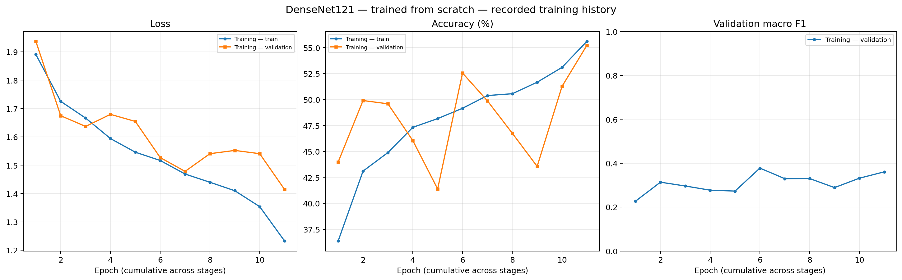
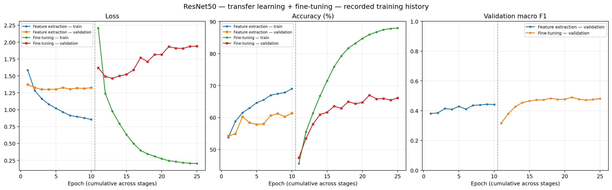
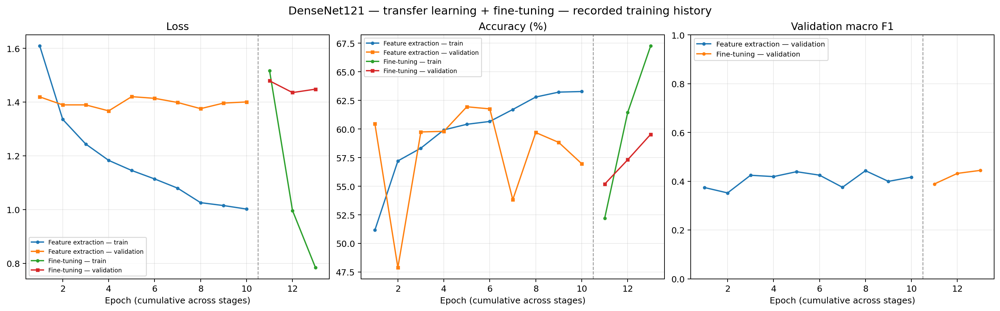
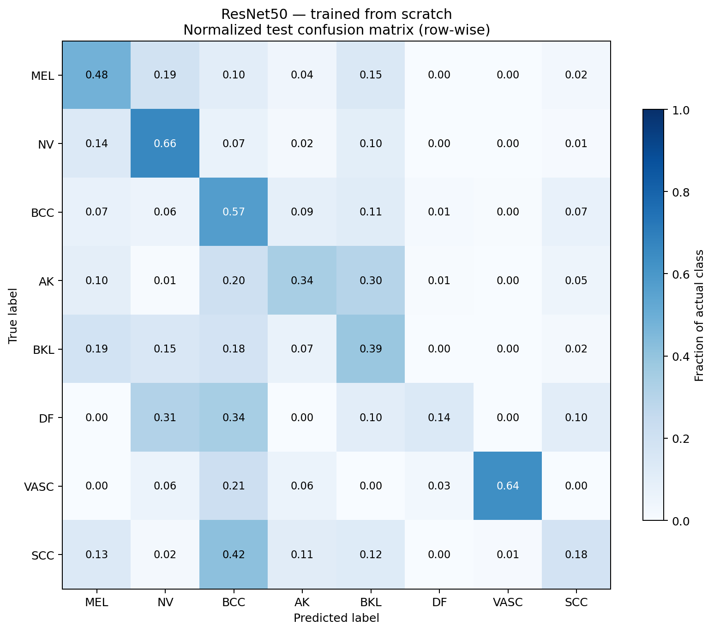
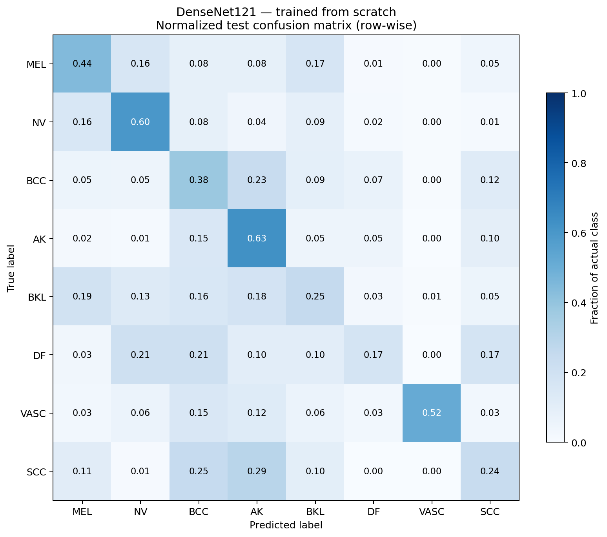
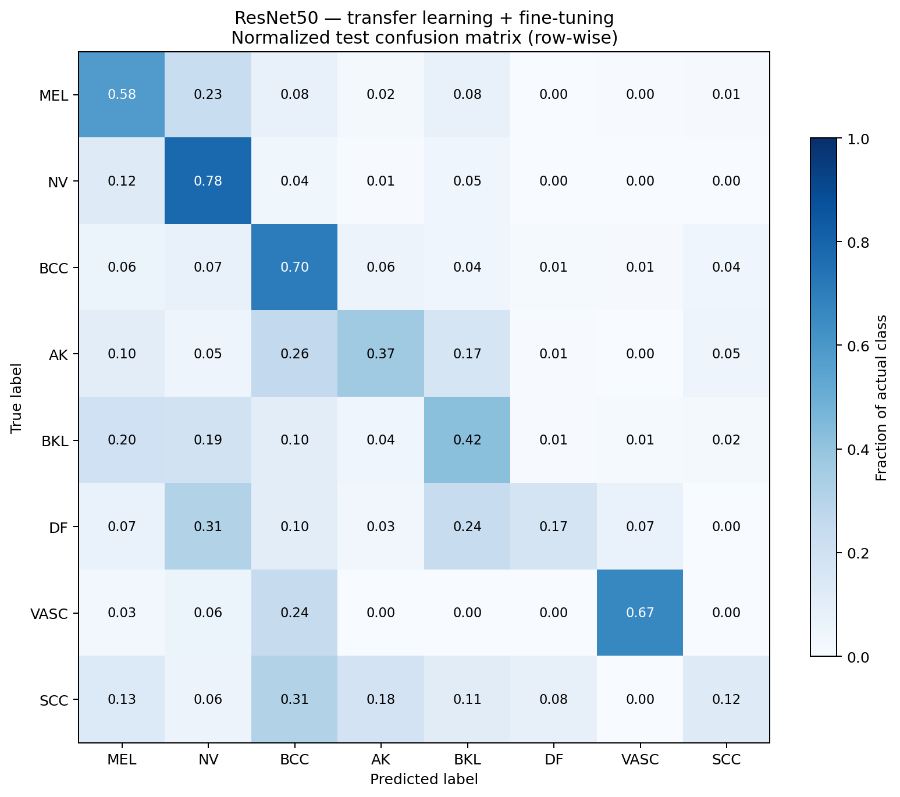

# ResNet50 vs DenseNet121 on ISIC 2019

**A comparative, in-progress deep-learning study of eight-class skin-lesion classification.**

This repository documents model training, transfer learning, fine-tuning, and class-aware evaluation using PyTorch. It contains **five cleaned Jupyter notebooks**, experiment configurations, training histories, and evaluation summaries. The dataset and pretrained/trained checkpoint files are **not** distributed here.

**Author:** [Manan Paliwal](https://github.com/Manan-Paliwal) · **Framework:** PyTorch · **Dataset:** ISIC 2019 · **Status:** In progress

## Research questions

- How do ResNet50 and DenseNet121 behave when trained from scratch on an imbalanced medical-image dataset?
- How does ImageNet initialization followed by feature extraction and fine-tuning affect evaluation results?
- How do model choices affect performance across common and underrepresented lesion classes?

The focus is on **controlled experiments and transparent evaluation**, not clinical deployment.

## Dataset and split design

The experiments use the **ISIC 2019** training dataset with **25,331 images** spanning eight diagnostic categories:

| Code | Diagnostic category |
|---|---|
| MEL | Melanoma |
| NV | Melanocytic nevus |
| BCC | Basal cell carcinoma |
| AK | Actinic keratosis |
| BKL | Benign keratosis |
| DF | Dermatofibroma |
| VASC | Vascular lesion |
| SCC | Squamous cell carcinoma |

Dataset preparation is described in [`00_Dataset_Preparation.ipynb`](notebooks/00_Dataset_Preparation.ipynb). The notebook:

1. Loads image labels and metadata, including lesion IDs when available.
2. Groups images by **lesion ID**, falling back to a unique image ID where a lesion ID is absent.
3. Performs class-stratified **group-level** train/validation/test splitting, targeting approximately **70% / 15% / 15%** of groups.
4. Checks that no group appears in more than one split, and saves the split CSVs for reuse.

Because the split happens at the **group** level, image-count percentages can differ slightly from the target proportions. All three published test evaluations report **3,808 test images**. Source images are cached at 256 × 256 before the 224 × 224 model input transforms.

## Experiments

| Notebook | Model | Training strategy | Published test evaluation |
|---|---|---|---|
| [01 — ResNet50 Scratch](notebooks/01_ResNet50_Scratch.ipynb) | ResNet50 | Random initialization | Available |
| [02 — DenseNet121 Scratch](notebooks/02_DenseNet121_Scratch.ipynb) | DenseNet121 | Random initialization | Available |
| [03 — ResNet50 Transfer](notebooks/03_ResNet50_Transfer.ipynb) | ResNet50 | ImageNet feature extraction, then fine-tuning | Available |
| [04 — DenseNet121 Transfer](notebooks/04_DenseNet121_Transfer.ipynb) | DenseNet121 | ImageNet feature extraction, then fine-tuning | **Pending** |

The documented configurations use **224 × 224** inputs, batch size **32**, AdamW, weighted cross-entropy, and an Apple Silicon **MPS** device. The scratch experiments record a maximum of 25 epochs and learning rate 0.0003. The transfer experiments use separate feature-extraction and fine-tuning stages. The published configurations for these runs indicate **no data augmentation**.

Full details, including learning rates and early-stopping settings, are in the JSON configurations under [`results/`](results/).

## Verified held-out test results

The following numbers are taken from the committed `*_test_results.json` files—not estimated from graphs.

| Model | Test accuracy | Macro F1 | Weighted F1 | Test loss |
|---|---:|---:|---:|---:|
| ResNet50 — scratch | 56.36% | 0.4120 | 0.5829 | 3.0361 |
| DenseNet121 — scratch | 49.53% | 0.3491 | 0.5292 | 1.5568 |
| ResNet50 — transfer + fine-tuning | 66.05% | 0.4623 | 0.6620 | 1.8281 |
| DenseNet121 — transfer + fine-tuning | Pending | Pending | Pending | Pending |

All three completed evaluations use the same reported test-set size (**3,808**). Macro F1 receives particular attention because it gives equal weight to each diagnostic class despite class imbalance. Accuracy alone can mask low recall or F1 for rarer classes.

**Observed within this experiment:** the ResNet50 transfer-learning run improved test accuracy over the ResNet50 scratch run by about **9.69 percentage points**, and macro F1 by about **0.0503**. This is a descriptive comparison on the published split, **not** a claim that either approach is universally superior. The DenseNet121 transfer-learning comparison remains incomplete.

**Source results:** [ResNet50 scratch](results/resnet50_scratch_test_results.json) · [DenseNet121 scratch](results/densenet121_scratch_test_results.json) · [ResNet50 transfer](results/resnet50_transfer_test_results.json)

## Visual results

The following plots are generated **from the committed training-history, test-results, and confusion-matrix files** using [`scripts/generate_figures.py`](scripts/generate_figures.py). Select an image to open it at full resolution. No model retraining is required.

### Held-out test comparison

[](figures/test_metrics_comparison.png)

*Three runs have verified held-out test results. DenseNet121 transfer learning is deliberately omitted from this comparison until its final test evaluation is available.*

### Training histories

Each figure shows training and validation loss, training and validation accuracy, and **validation macro F1** by epoch. Transfer-learning charts distinguish feature extraction from fine-tuning with a dashed boundary.

| ResNet50 from scratch | DenseNet121 from scratch |
|:---:|:---:|
| [](figures/resnet50_scratch_training.png) | [](figures/densenet121_scratch_training.png) |

| ResNet50 transfer learning | DenseNet121 transfer learning |
|:---:|:---:|
| [](figures/resnet50_transfer_training.png) | [](figures/densenet121_transfer_training.png) |

*The DenseNet121 transfer-learning history is available even though its final held-out test metrics have not yet been published. The plots reflect recorded runs rather than comparable wall-clock budgets.*

### Normalized test confusion matrices

The rows represent the **true diagnostic class**, and the columns represent the **predicted class**. Each row is divided by the total number of test examples in that class, so diagonal values show class-specific recall. These images summarize per-class errors; they do **not** establish clinical validity.

| ResNet50 from scratch | DenseNet121 from scratch |
|:---:|:---:|
| [](figures/resnet50_scratch_confusion_matrix.png) | [](figures/densenet121_scratch_confusion_matrix.png) |

**ResNet50 transfer learning:**

[](figures/resnet50_transfer_confusion_matrix.png)

*The DenseNet121 transfer-learning test confusion matrix will be added only after the evaluation is complete.*

To regenerate the figures locally after cloning and installing the dependencies:

```bash
python scripts/generate_figures.py
```

This writes eight PNG files under `figures/` without loading the ISIC images or trained checkpoints.

## Repository layout

```text
.
├── README.md
├── requirements.txt
├── .gitignore
├── notebooks/
│   ├── 00_Dataset_Preparation.ipynb
│   ├── 01_ResNet50_Scratch.ipynb
│   ├── 02_DenseNet121_Scratch.ipynb
│   ├── 03_ResNet50_Transfer.ipynb
│   └── 04_DenseNet121_Transfer.ipynb
└── results/
    ├── *_history.csv
    ├── *_test_results.json
    ├── *_confusion_matrix*.csv
    ├── *_per_class_results.csv
    ├── *_config.json
    └── public_configs/
        └── *_transfer_stage2_config.json
```

The `results/` directory preserves numerical histories, per-class results, confusion matrices, and configuration records where available. The publicly shared notebooks have **saved cell outputs removed**; this does not remove the separate committed evaluation files.

## Environment and reproducing the workflow

The notebooks were developed on a Mac with PyTorch's MPS backend. Exact package versions are **not pinned or independently revalidated** in this repository; `requirements.txt` lists the primary libraries used by the notebooks.

```bash
git clone https://github.com/Manan-Paliwal/resnet50-densenet121-isic2019.git
cd resnet50-densenet121-isic2019
python -m pip install -r requirements.txt
jupyter lab
```

1. Obtain the ISIC 2019 training images, ground-truth CSV, and metadata CSV from the official ISIC dataset source. Follow the data provider's license and access terms.
2. In [the dataset-preparation notebook](notebooks/00_Dataset_Preparation.ipynb), confirm the `RAW_DATA_DIR`, `IMAGE_DIR`, `GROUND_TRUTH_FILE`, and `METADATA_FILE` locations match your extraction layout. The notebook currently expects `dataset/ISIC_2019_raw/` under the project root, with a nested training-image directory.
3. **Launch JupyterLab from the project root**, because the notebooks set `PROJECT_DIR = Path.cwd()`. Run dataset preparation first to generate `dataset/ISIC_2019_master.csv` and `dataset/splits/{train,val,test}.csv`.
4. Run the experiment notebooks using the same prepared splits, adjusting compute settings for your device.

**Reproduction limitations:** The dataset, saved image cache, and large checkpoint files are excluded. Stage-2 public configurations replace the original `starting_checkpoint` paths with placeholders. Reproducing fine-tuning requires generating your own Stage-1 checkpoints. Some notebook cells also assume experiment artifacts were created by earlier cells or runs; this repository is a documented experimental workflow, **not a tested one-command reproduction package**. GPU/CUDA settings may require changes from the original MPS configuration.

## Limitations and ongoing work

- The evaluation is limited to the documented ISIC 2019 split; generalization to other institutions, acquisition devices, or populations has **not** been established.
- Class imbalance and small support for rare diagnostic classes remain important evaluation concerns.
- Scratch and transfer runs are not proof of causal architectural superiority; initialization, optimization, and training budgets also affect results.
- The DenseNet121 transfer-learning test evaluation is not yet published.
- Planned work includes augmentation studies, further architecture comparisons, confusion-matrix interpretation, robustness checks, and ensemble experiments.

> **Medical disclaimer:** This is an educational research project. It is not a validated diagnostic system and must not be used to guide patient care.

---

**Maintainer:** [Manan Paliwal](https://github.com/Manan-Paliwal) · [LinkedIn](https://www.linkedin.com/in/manan-paliwal)
